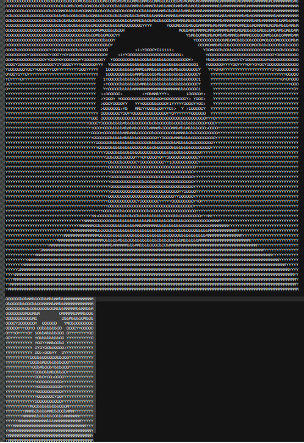

# ASCIIimage

 <h1> ASCII ART CREATOR </h1>

 ## ==> [ASCIIimage ](https://htmlpreview.github.io/?https://github.com/jamalamch/ASCIIimage/blob/master/index.html) <==

Ascii Art creator allows you to convert images to  monochrome Ascii Art

  
 

    ASCII art technique is widely used artists, hobbysts, hackers. Especially
    interesting example of use and creatidevelopment of the ASCII art are
    works created by the "ASCII AEnsemble" group. The group, formed Walter
    van der Cruijsen, Luka Frelih, VCosic, was founded in 1998. Members of
    the "ASCII Art Ensemble" createdsoftware to "code" moving images into
    animated (sequential) ASCII art pieceMost recognizable work by the group
    is "Deep ASCII" - an ASCII version the famous pornographic film "Deep
    Throat" from 1972.

